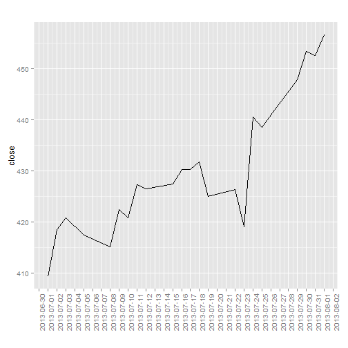
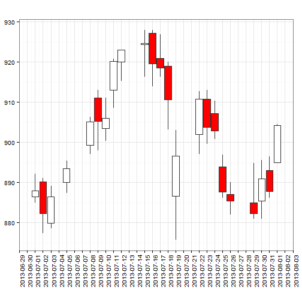
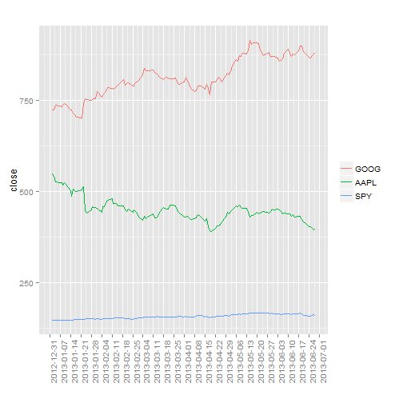

Examples of using FinCal
========================================================
Created on Fri Jul 19 2013   
Updated on Wed Sep 25 15:52:34 2013   


FinCal -- Time Value of Money, time series analysis and Computational Finance
--------------------------------------------------------------------------------    
FinCal is available on [CRAN] (http://cran.r-project.org/web/packages/FinCal/) and [GitHub](http://felixfan.github.io/FinCal/)


```r
library(FinCal)
```


Functions available:    

```r
ls("package:FinCal")
```

```
 [1] "bdy"                   "bdy2mmy"              
 [3] "candlestickChart"      "cash.ratio"           
 [5] "coefficient.variation" "cogs"                 
 [7] "current.ratio"         "date.breaks"          
 [9] "ddb"                   "debt.ratio"           
[11] "diluted.EPS"           "discount.rate"        
[13] "ear"                   "ear.continuous"       
[15] "ear2bey"               "ear2hpr"              
[17] "EPS"                   "financial.leverage"   
[19] "fv"                    "fv.annuity"           
[21] "fv.simple"             "fv.uneven"            
[23] "geometric.mean"        "get.ohlc.google"      
[25] "get.ohlc.yahoo"        "get.ohlcs.google"     
[27] "get.ohlcs.yahoo"       "gpm"                  
[29] "harmonic.mean"         "hpr"                  
[31] "hpr2bey"               "hpr2ear"              
[33] "hpr2mmy"               "irr"                  
[35] "iss"                   "lineChart"            
[37] "lineChartMult"         "lt.d2e"               
[39] "mmy2hpr"               "n.period"             
[41] "npm"                   "npv"                  
[43] "pmt"                   "pv"                   
[45] "pv.annuity"            "pv.perpetuity"        
[47] "pv.simple"             "pv.uneven"            
[49] "quick.ratio"           "r.continuous"         
[51] "r.norminal"            "r.perpetuity"         
[53] "sampling.error"        "SFRatio"              
[55] "Sharpe.ratio"          "slde"                 
[57] "total.d2e"             "twrr"                 
[59] "volumeChart"           "was"                  
[61] "wpr"                  
```


Getting help on a function (e.g., pv)    
```
help{pv}    # display the documentation for the function
args{pv}    # see arguments of the function
example{pv} # see example of using the function
```

```
Note: for all examples, cash inflows are positive and outflows are negative.
```

Example 1 Computing effective annual rate (EAR)    
-------------------------------------------------------
Using a stated rate of 4.25%, compute EARs for semiannual, quarterly, monthly, daily and continuous compounding.   

```r
ear(0.0425, 2)
```

```
[1] 0.04295
```

```r
ear(0.0425, 4)
```

```
[1] 0.04318
```

```r
ear(0.0425, 12)
```

```
[1] 0.04334
```

```r
ear(0.0425, 365)
```

```
[1] 0.04341
```

```r
ear.continuous(0.0425)
```

```
[1] 0.04342
```


Example 2 Future value (FV) of a single sum
---------------------------------------------------------
Calculate the FV of a $500 investment at the end of ten years if it earns an annually compounded rate of return of 6%.   

```r
fv.simple(r = 0.06, n = 10, pv = -500)
```

```
[1] 895.4
```


Example 3 PV of a single sum
--------------------------------------------
Given a discount rate of 3%, calculate the PV of a $1,000,000 cash flow that will be received in five years.   

```r
pv.simple(r = 0.03, n = 5, fv = 1e+06)
```

```
[1] -862609
```


Example 4 FV of an ordinary annuity and annuity due
------------------------------------------
What is the future value of an ordinary annuity that pays $15,000 per year at the end of each of the next 25 years, given the investment is expected to earn a 6% rate of return?    

```r
fv.annuity(r = 0.06, n = 25, pmt = -15000, type = 0)
```

```
[1] 822968
```


What is the future value of an annuity that pays $10,000 per year at the beginning of each of the next three years, commencing today, if the cash flows can be invested at an annual rate of 5%?    

```r
fv.annuity(r = 0.05, n = 3, pmt = -10000, type = 1)
```

```
[1] 33101
```


Example 5 PV of an ordinary annuity and annuity due
----------------------------------------------------------
What is the PV of an annuity that pays $20,000 per year at the end of each of the next 25 years, given a 6% discount rate?

```r
pv.annuity(r = 0.06, n = 25, pmt = -20000, type = 0)
```

```
[1] 255667
```


Given a discount rate of 10%, what is the present value of a 10-year annuity that makes a series of $1000 payments at the beginning of each of the next three years, starting today?   

```r
pv.annuity(r = 0.1, n = 10, pmt = -1000, type = 1)
```

```
[1] 6759
```


Example 6 PV of a perpetuity
-------------------------------------------
A preferred stock that will pay $2.50 per year in annual dividends beginning next year and plans to follow this dividend policy forever. Given an 10% rate of return, what is the value of this preferred stock today?

```r
pv.perpetuity(r = 0.1, pmt = 2.5, type = 0)
```

```
[1] -25
```


Example 7 Rate of return for a perpetuity
------------------------------------------------
Using the preferred stock described in the preceding example, determine the rate of return that an investor would realize if she paid $75 per share for the stock.

```r
r.perpetuity(pmt = 2.5, pv = -75)
```

```
[1] 0.03333
```


Example 8 PV of a bond's cash flows
-------------------------------------
A bond will make coupon interest payments of 70 HK$ (7% of its face value) at the end of each year and will also pay its face value of 1,000 HK$ at maturity in 10 years. If the appropriate discount rate is 6%, what is the present value of the bond's promised cash flows?     

```r
pv(r = 0.06, n = 10, fv = 1000, pmt = 70, type = 0)
```

```
[1] -1074
```


Example 9 Computing the FV and PV of an uneven cash How series
-----------------------------------------------------------
Using a rate of return of 6%, compute the future value of the 6-year uneven cash flow stream occured at the end of each year.  (-10000 -5000 2000 4000 6000 8000)

```r
fv.uneven(r = 0.06, cf = c(-10000, -5000, 2000, 4000, 6000, 8000))
```

```
[1] -1542
```


Compute the present value of this 6-year uneven cash How stream described above using a 10% rate of return.     

```r
pv.uneven(r = 0.1, cf = c(-10000, -5000, 2000, 4000, 6000, 8000))
```

```
[1] 747.1
```


Example 10 Loan payment calculation: Annual payments and Quarterly payments
--------------------------------------------------------------------------------
A company plans to borrow $500,000 for five years. The company's bank will lend the money at a rate of 6% and requires that the loan be paid off in five equal end-of-year payments. Calculate the amount of the payment that the company must make in order to fully amortize this loan in five years.   

```r
pmt(r = 0.06, n = 5, pv = 5e+05, fv = 0)
```

```
[1] -118698
```


Example 11 Computing the number of periods in an annuity
---------------------------------------------------------------------
How many $1000 end-of-year payments are required to accumulate $10,000 if the discount rate is 9%?   

```r
n.period(r = 0.09, pv = 0, fv = 10000, pmt = -1000, type = 0)
```

```
[1] 7.448
```


Example 12 Computing the rate of return for a period
-------------------------------------------------------------------------------------
Suppose you have the opponunity to invest $1000 at the end of each of the next five years in exchange for $6000 at the end of the fifth year. What is the annual rate of return on this investment?    

```r
discount.rate(n = 5, fv = 6000, pmt = -1000, pv = 0, type = 0)
```

```
[1] 0.0913
```


Example 13 Computing NPV
------------------------------------------
Calculate the NPV of an investment project with an initial cost of $6 million and positive cash flows of $2.6 million at the end of Year 1, $2.4 million at the end of Year 2, and $3.8 million at the end ofYear 3. Use 8% as the discount rate.   

```r
npv(r = 0.08, cf = c(-6, 2.6, 2.4, 3.8))
```

```
[1] 1.482
```


Example 14 Computing IRR
-----------------------------------------
What is the IRR for the investment described in example 13?   

```r
irr(cf = c(-6, 2.6, 2.4, 3.8))
```

```
[1] 0.2033
```


Example 15 Computing HPR
--------------------------------------------
Suppose a stock is purchased for $3 and is sold for $4 six months later, during which time it paid $0.50 in dividends. What is the holding period return?   

```r
hpr(ev = 4, bv = 3, cfr = 0.5)
```

```
[1] 0.5
```


Example 16 Computing time-weighted rate of return
---------------------------------------------------
An investor purchases a share of stock at t = 0 for $10. At the end of the year, t = 1 , the investor buys another share of the same stock for $12. At the end of Year 2, the investor sells both shares for $13 each. At the end of both years 1 and 2, the stock paid a $1 per share dividend. What is the annual time-weighted rate of return for this investment?    

```r
twrr(ev = c(12, 26), bv = c(10, 24), cfr = c(1, 2))
```

```
[1] 0.2315
```


Example 17 Computing Bank discount yield
-----------------------------------------------
Calculate the bank discount yield for a T-hill priced at $9,850, with a face value of $10,000 and 120 days until maturity.    

```r
bdy(d = 150, f = 10000, t = 120)
```

```
[1] 0.045
```


Example 18 Convert holding period return to the effective annual rate
------------------------------------------------------------------------
Compute the EAY using the 120-day HPY of 2.85%.    

```r
hpr2ear(hpr = 0.0285, t = 120)
```

```
[1] 0.08923
```


Example 19 Computing money market yield
-----------------------------------------------------------------------------
What is the money market yield for a 120-day T-bill that has a bank discount yield of 4.50%?    

```r
bdy2mmy(bdy = 0.045, t = 120)
```

```
[1] 0.04569
```


Example 20 Converting among EAR, HPY, and MMY
----------------------------------------------------
Assume the price of a $10,000 T-hill that matures in 150 days is $9,800. The quoted money market yield is 4.898%. Compute the HPY and the EAR.    

```r
hpr(ev = 10000, bv = 9800)
```

```
[1] 0.02041
```

```r
mmy2hpr(mmy = 0.04898, t = 150)
```

```
[1] 0.02041
```

```r
hpr2ear(hpr = mmy2hpr(mmy = 0.04898, t = 150), t = 150)
```

```
[1] 0.05039
```

```r
ear2hpr(ear = hpr2ear(hpr = mmy2hpr(mmy = 0.04898, t = 150), t = 150), t = 150)
```

```
[1] 0.02041
```


Example 21 Bond-equivalent yield calculation
-----------------------------------------------------
What is the yield on a bond-equivalent basis of a 3-month loan has a holding period yield of 4%?       

```r
hpr2bey(hpr = 0.04, t = 3)
```

```
[1] 0.1632
```


What is the yield on a bond-equivalent basis of an investment with 6% effective annual yield?   

```r
ear2bey(ear = 0.06)
```

```
[1] 0.05913
```


Example 22 Weighted mean as a portfolio return
---------------------------------------------------
A portfolio consists of 40% common stocks, 50% bonds, and 10% cash. If the return on common stocks is 9%, the return on bonds is 6%, and the return on cash is 1%, what is the portfolio return?     

```r
wpr(r = c(0.09, 0.06, 0.01), w = c(0.4, 0.5, 0.1))
```

```
[1] 0.067
```


or   

```r
rs = c(0.09, 0.06, 0.01)
ws = c(0.4, 0.5, 0.1)
wpr(r = rs, w = ws)
```

```
[1] 0.067
```


Example 23 Geometric mean return
-------------------------------------------------
For the last three years, the returns for Acme Corporation common stock have been -5%, 11%, and 9%. Compute the compound annual rate of return over the 3-year period.     

```r
geometric.mean(r = c(-0.05, 0.11, 0.09))
```

```
[1] 0.04751
```


Example 24 Calculating average cost with the harmonic mean
------------------------------------------------------------
An investor purchases $10,000 of stock each month, and over the last three months the prices paid per share were $4.5, $5.2, and $4.8. What is the average cost per share for the shares acquired?      

```r
harmonic.mean(p = c(4.5, 5.2, 4.8))
```

```
[1] 4.816
```


Example 25 Download historical financial data from Yahoo finance and Google Finance
---------------------------------------------------------------------------------------
Download historical financial data from Yahoo finance       

```r
apple <- get.ohlc.yahoo(symbol = "AAPL", start = "2013-07-01", end = "2013-08-01")
head(apple)
```

```
         date  open  high   low close   volume adjusted
23 2013-07-01 402.7 412.3 401.2 409.2 13966200    406.5
22 2013-07-02 410.0 421.6 409.5 418.5 16780900    415.7
21 2013-07-03 420.9 423.0 417.4 420.8  8604600    418.0
20 2013-07-05 420.4 423.3 415.4 417.4  9786600    414.7
19 2013-07-08 420.1 421.0 410.6 415.1 10647800    412.3
18 2013-07-09 413.6 423.5 410.4 422.4 12592300    419.6
```


Download historical financial data from Google Finance    

```r
google <- get.ohlc.google(symbol = "GOOG", start = "2013-07-01", end = "2013-08-01")
head(google)
```

```
         date  open  high   low close  volume
23 2013-07-01 886.5 892.1 885.0 887.9 1726780
22 2013-07-02 890.2 891.0 877.3 882.3 1891812
21 2013-07-03 879.9 889.2 878.5 886.4 1048628
20 2013-07-05 890.0 895.4 887.3 893.5 1701830
19 2013-07-08 899.2 906.3 897.1 905.1 1970157
18 2013-07-09 911.0 913.0 898.0 905.2 1979338
```


Download multiple historical financial data from Yahoo finance

```r
applegoog <- get.ohlcs.yahoo(symbols = c("AAPL", "GOOG"), start = "2013-01-01", 
    end = "2013-07-31")
head(applegoog$AAPL)
```

```
          date  open  high   low close   volume adjusted
146 2013-01-02 553.8 555.0 541.6 549.0 20018500    538.7
145 2013-01-03 547.9 549.7 541.0 542.1 12605900    531.9
144 2013-01-04 537.0 538.6 525.8 527.0 21226200    517.1
143 2013-01-07 522.0 529.3 515.2 523.9 17291300    514.0
142 2013-01-08 529.2 531.9 521.2 525.3 16382400    515.4
141 2013-01-09 522.5 525.0 516.0 517.1 14557300    507.4
```

```r
head(applegoog$GOOG)
```

```
          date  open  high   low close  volume adjusted
146 2013-01-02 719.4 727.0 716.5 723.2 2541300    723.2
145 2013-01-03 724.9 731.9 720.7 723.7 2318200    723.7
144 2013-01-04 729.3 741.5 727.7 738.0 2763500    738.0
143 2013-01-07 735.5 739.4 730.6 734.8 1655700    734.8
142 2013-01-08 735.5 736.3 724.4 733.3 1676100    733.3
141 2013-01-09 732.3 738.4 728.6 738.1 2024700    738.1
```


Download multiple historical financial data from Google Finance

```r
all <- get.ohlcs.google(symbols = c("YHOO", "SPY", "SINA"), start = "2013-01-01", 
    end = "2013-07-31")
head(all$YHOO)
```

```
          date  open  high   low close   volume
146 2013-01-02 20.20 20.32 20.01 20.08 20463033
145 2013-01-03 20.05 20.10 19.72 19.78 19599094
144 2013-01-04 19.76 19.95 19.72 19.86 12489700
143 2013-01-07 19.56 19.58 19.28 19.40 23866609
142 2013-01-08 19.32 19.68 19.30 19.66 16932176
141 2013-01-09 19.73 19.75 19.22 19.33 21656278
```

```r
head(all$SPY)
```

```
          date  open  high   low close    volume
146 2013-01-02 145.1 146.2 144.7 146.1 192058911
145 2013-01-03 146.0 146.4 145.3 145.7 144761781
144 2013-01-04 146.0 146.6 145.7 146.4 116817675
143 2013-01-07 145.8 146.4 145.4 146.0 110002444
142 2013-01-08 145.7 145.9 145.0 145.6 121265078
141 2013-01-09 145.9 146.3 145.6 145.9  90745581
```

```r
head(all$SINA)
```

```
          date  open  high   low close  volume
146 2013-01-02 52.24 55.19 51.75 52.27 3947513
145 2013-01-03 52.34 53.61 51.54 52.77 2200712
144 2013-01-04 52.70 52.94 51.70 52.76 1466652
143 2013-01-07 51.81 52.67 51.40 52.57 1368991
142 2013-01-08 52.20 53.00 51.41 51.81 1381026
141 2013-01-09 51.76 52.43 50.61 51.54 2098518
```


Example 26 Plots open-high-low-close chart of (financial) time series.
----------------------------------------------------------------------
Line chart   

```r
apple <- get.ohlc.yahoo(symbol = "AAPL", start = "2013-07-01", end = "2013-08-01")
lineChart(apple)
```

 


Candlestick chart     

```r
google <- get.ohlc.yahoo("GOOG", start = "2013-07-01", end = "2013-08-01")
candlestickChart(google)
```

 


Volume chart   

```r
apple <- get.ohlc.google("AAPL")
volumeChart(apple)
```

 


Multiple line chart   

```r
googapple <- get.ohlcs.yahoo(c("GOOG", "AAPL", "SPY"), start = "2013-01-01", 
    end = "2013-06-30")
lineChartMult(googapple)
```

 


Examples 27 Inventory Expense Recognition -- cost of goods sold
------------------------------------------------
Three methods: first-in, first-out (FIFO) method; last-in, first-out (LIFO) method; weighted average cost method.

e.g. during one month   
beginning inventory: 20 units @ $2/unit   
buy                : 30 units @ $3/unit    
buy                : 50 units @ $5/unit    
sold               : 70 units    
what is the cost of goods sold using three menthod?   

```r
# first-in, first-out (FIFO) method
cogs(uinv = 20, pinv = 2, units = c(30, 50), price = c(3, 5), sinv = 70, method = "FIFO")
```

```
$costOfGoods
[1] 230

$endingInventory
[1] 150
```

```r
# last-in, first-out (LIFO) method
cogs(uinv = 20, pinv = 2, units = c(30, 50), price = c(3, 5), sinv = 70, method = "LIFO")
```

```
$costOfGoods
[1] 310

$endingInventory
[1] 70
```

```r
# weighted average cost method
cogs(uinv = 20, pinv = 2, units = c(30, 50), price = c(3, 5), sinv = 70, method = "WAC")
```

```
$costOfGoods
[1] 266

$endingInventory
[1] 114
```


Example 28 Depreciation Expense Recognition
----------------------------------------------
Methods: straight line depreciation method, double-declining balance (DDB)   
e.g.,   
One Company recently purchased a machine at a cost of $9,800. The machine is expected to have a residual value of $2,000 at the end of its useful life in five years. What is the depreciation expense for all five years using two different menthods?  


```r
# straight line depreciation method
slde(cost = 9800, rv = 2000, t = 5)
```

```
[1] 1560
```

```r
# double-declining balance (DDB)
ddb(cost = 9800, rv = 2000, t = 5)
```

```
     t    ddb
[1,] 1 3920.0
[2,] 2 2352.0
[3,] 3 1411.2
[4,] 4  116.8
[5,] 5    0.0
```


Example 29 Weighted average shares and EPS
---------------------------------------------
One company has net income of $100,000 and paid $10,000 cash dividends to its preferred shareholders and $10,750 cash dividends to its common shareholders. At the beginning of the year, there were 20,000 shares of common stock outstanding. 20,000 new shares were issued on July 1 . what is the weighted average shares and basic EPS?   

```r
# weighted average shares
was = was(ns = c(20000, 20000), nm = c(12, 6))
was
```

```
[1] 30000
```

```r
# basic EPS
EPS(ni = 1e+05, pd = 10000, w = was)
```

```
[1] 3
```


One company has 15,000 shares outstanding all year. It had 2,000 outstanding warrants all year, convertible into one share each at $20 per share. The year-end price of stock was $40, and the average stock price was $30. What effect will these warrants have on the weighted average number of shares?

```r
iss(amp = 30, ep = 20, n = 2000)
```

```
[1] 666.7
```


During 2013, X reported net income of $231,200 and had 400,000 shares of
common stock outstanding for the entire year. X had 2,000 shares of 10%, $100
par convertible preferred stock, convertible into 40 shares each, outstanding for the
entire year. X also had 1200, 7%, $1,000 par value convertible bonds, convertible
into 100 shares each, outstanding for the entire year. Finally, X had 20,000 stock
options outstanding during the year. Each option is convertible into one share of
stock at $15 per share. The average market price of the stock for the year was $20. The tax rate is 40%. What are X's basic and diluted EPS?

```r
EPS(ni = 231200, pd = 2000 * 0.1 * 100, w = 4e+05)
```

```
[1] 0.528
```

```r
iss = iss(amp = 20, ep = 15, n = 20000)
diluted.EPS(ni = 231200, pd = 2000 * 0.1 * 100, cpd = 2000 * 0.1 * 100, cdi = 1200 * 
    0.07 * 1000, tax = 0.4, w = 4e+05, cps = 2000 * 40, cds = 1200 * 100, iss = iss)
```

```
[1] 0.4655
```

